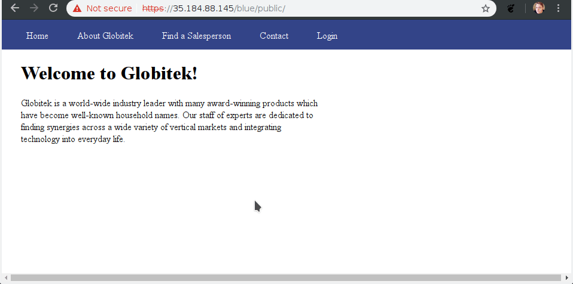
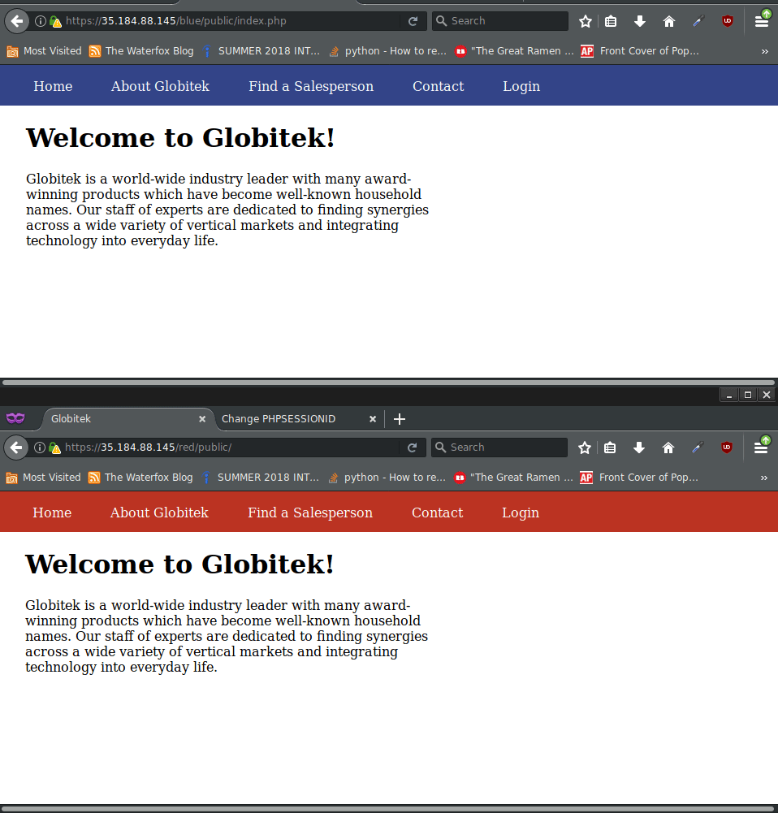
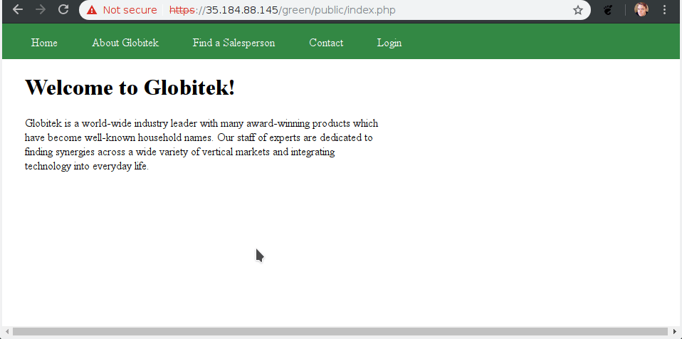
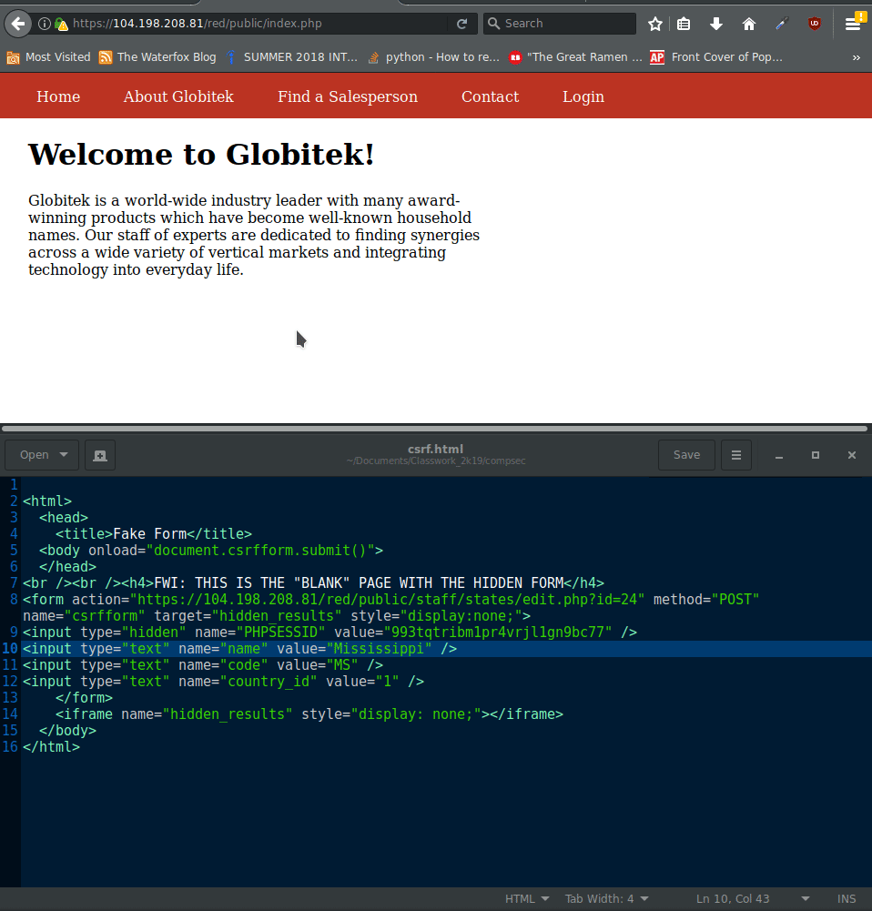

# Week 9 Project: Pentesting Live Targets

Time spent: 5 hours spent in total

> Objective: Identify vulnerabilities in three different versions of the Globitek website: blue, green, and red.

The six possible exploits are:
* Username Enumeration
* Insecure Direct Object Reference (IDOR)
* SQL Injection (SQLi)
* Cross-Site Scripting (XSS)
* Cross-Site Request Forgery (CSRF)
* Session Hijacking/Fixation

Each version of the site has been given two of the six vulnerabilities. (In other words, all six of the exploits should be assignable to one of the sites.)

## Blue

### Vulnerability #1: SQL Injection

Description: Most of the data input received by these websites is being sanitized properly. However, one of the three sites has one place where the input is not being sanitized before being used in an SQL query. Determine which color has the vulnerability.

Gif: 

Explaination: 
This vulnerability was found using SQLMAP. sqlmap detected an AND Time-based blind vulnerability, which means this is at the very least susceptible to time-based sql injectons. This gif demonstrates that the SLEEP() command can be inserted, causing the database to freeze for several seconds. This can be used for a DOS attack.

### Vulnerability #2: Session Hijacking

Description: Two of the three websites expire their active sessions and require users to re-login every 30 minutes. That is probably too aggressive for the real world, but it is better than the third site which allows sessions to be a year old, and never regenerates the session ID, even when the user agent string changes. This makes it vulnerable to both session hijacking and session fixation attacks.

Gif: 

Explaination: 
This gif demonstrates session hijacking. The target (blue) logs in first. The logged-in session on blue has its ID stolen by red, who is now able to log in for as long as blue's session is valid.

## Green

### Vulnerability #1: Username Enumeration

Description: A careless developer mistake has created a username enumeration vulnerability. Determine which color has the vulnerability. You can use the existing username "jmonroe99" as a test. Next, figure out what mistake the developer made.

Gif: 

Explaination: 
The classes for the error messages are different. When a username exists, the error message is bolded. When a username doesn't exist, the error message is displayed with normally weighted text. The change is subtle, but this mistake allows us to know the users that do and do not exist.

### Vulnerability #2: Cross Site Scripting

Description: All three sites do a good job of protecting against a reflected XSS attack. However, one of the sites has a mistake which leaves the site vulnerable to a stored XSS attack. A reflected XSS attack would be easy to reveal, while a stored XSS does not provide instant feedback. You will need to log into the admin area and look through the CMS in order to "spring the trap" and find out if your attack succeeded. Determine which color has the vulnerability. Remember, others will be attacking these sites alongside you. Use your name in the XSS so that your results won't be confused with anyone else's

Gif: 

Explaination: 
This gif shows that the feedback system on green is susceptible to an XSS attack. Whenever an admin goes to view user feedback, they are running any javascript submitted in the feedback textbox.

## Red

### Vulnerability #1: Insecure Direct Object Reference

Description: One of the three sites is missing code which would prevent some sensitive information from being made public. Determine which color has the vulnerability. Then, figure out what the other two sites did correctly to prevent the information leak.

Gif: 

Explaination: 
The salespeople ids on red have two entries that should not be available to the public.
There's no direct links to these entries, but altering the id numbers in the GET request allows us to get there.
There's no protection mechanisms in place to ensure that non-admin users are unable to see unauthorized information.

### Vulnerability #2: Cross-Site Request Forgery

Description: One of the three sites does not have CSRF protections on the admin area. A clever attacker could design a form which would automatically submit form data to the staff area and take advantage of a logged in user's access permissions. Be the attacker and design a form which will make a change to the spelling of some database content. (For example, change the first user from "James" to "Jim", or change "Alabama" to "Alabamaaaa".) Then point the form action at each of the three sites to find out which color has the vulnerability. Do not neglect to be stealthy with your form—your unsuspecting, logged-in admin should neither see the form nor the results of the form submission.

Gif: 

Explaination: 
This is a HTML page that is up on my home system, but it could be hosted anywhere.
It only needs a logged-in admin to visit the page and the request is sent automatically while being hidden from view.
The form targets red's state information update system and updates the state information for mississippi.

